# Architecture diagrams

How the code fits together and how data flows through it. The diagrams are [Mermaid](https://mermaid.js.org/); GitHub renders them in place. Design decisions and their reasons are in [`PROJECT_PLAN.md`](../PROJECT_PLAN.md); this page shows the result.

Legend: dashed lines and *(planned)* mark parts of later stages that don't exist yet.

Contents:

1. [System overview](#1-system-overview): containers, network, data
2. [Module dependencies](#2-module-dependencies): which Python module uses which
3. [Database schema](#3-database-schema-er-diagram): tables and keys
4. [Database models](#4-database-models-class-diagram) and [API models](#5-api-models-class-diagram)
5. [Fetch run](#6-fetch-run-sequence) and [one feed entry through ingest](#7-one-feed-entry-through-ingest-flowchart)
6. [Routing and authentication](#8-routing-and-authentication-flowchart)
7. [`GET /queue`](#9-get-queue-sequence), [`POST /swipes`](#10-post-swipes-sequence) and the [read endpoints](#11-get-feeds-get-saved-and-saved-content-sequence)
8. [Extraction job](#12-extraction-job-sequence) and the [SSRF guard](#13-ssrf-guard-connect-time-check-flowchart)
9. Lifecycles: [an item](#14-item-lifecycle-state-diagram) and [a saved entry](#15-saved-entry-extraction-state-diagram)
10. [Phone sync with dead letters](#16-phone-swipe-sync-sequence-planned) *(planned)*
11. [Mutation checks](#17-mutation-checks-scriptsmutantspy-flowchart) and the [development loop](#18-development-loop-flowchart)

---

## 1. System overview

Everything runs on one server in Docker Compose. Only Tailscale Serve faces the network, and only inside the tailnet; containers publish on loopback.

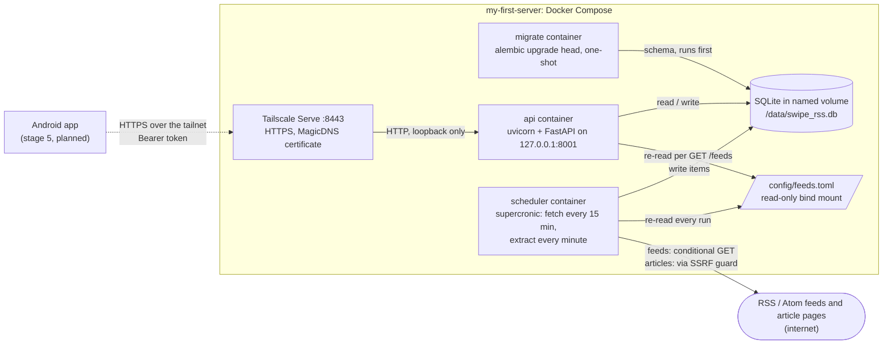
```mermaid
flowchart LR
    feeds(["RSS / Atom feeds and article pages<br/>(internet)"])
    app["Android app<br/>(stage 5, planned)"]

    subgraph server["my-first-server: Docker Compose"]
        migrate["migrate container<br/>alembic upgrade head, one-shot"]
        serve["Tailscale Serve :8443<br/>HTTPS, MagicDNS certificate"]
        api["api container<br/>uvicorn + FastAPI on 127.0.0.1:8001"]
        db[("SQLite in named volume<br/>/data/swipe_rss.db")]
        sched["scheduler container<br/>supercronic: fetch every 15 min,<br/>extract every minute"]
        cfg[/"config/feeds.toml<br/>read-only bind mount"/]
    end

    migrate -- "schema, runs first" --> db
    app -. "HTTPS over the tailnet<br/>Bearer token" .-> serve
    serve -- "HTTP, loopback only" --> api
    api -- "read / write" --> db
    sched -- "write items" --> db
    sched -- "re-read every run" --> cfg
    api -- "re-read per GET /feeds" --> cfg
    sched -- "feeds: conditional GET<br/>articles: via SSRF guard" --> feeds
```

## 2. Module dependencies

Arrows point from a module to the modules it imports. `api_models.py` is generated from the OpenAPI spec and never edited by hand.

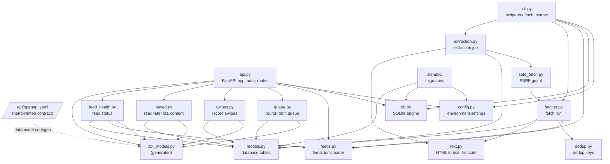
```mermaid
flowchart TD
    spec[/"api/openapi.yaml<br/>(hand-written contract)"/]
    cli["cli.py<br/>swipe-rss fetch, extract"]
    fetcher["fetcher.py<br/>fetch run"]
    feeds["feeds.py<br/>feeds.toml loader"]
    dedup["dedup.py<br/>dedup keys"]
    text["text.py<br/>HTML to text, truncate"]
    api["api.py<br/>FastAPI app, auth, routes"]
    queue["queue.py<br/>round-robin queue"]
    swipes["swipes.py<br/>record swipes"]
    saved["saved.py<br/>read-later list, content"]
    health["feed_health.py<br/>feed status"]
    extraction["extraction.py<br/>extraction job"]
    safe["safe_fetch.py<br/>SSRF guard"]
    api_models["api_models.py<br/>(generated)"]
    models["models.py<br/>database tables"]
    db["db.py<br/>SQLite engine"]
    config["config.py<br/>environment settings"]
    alembic["alembic/<br/>migrations"]

    spec -. "datamodel-codegen" .-> api_models
    cli --> config & db & feeds & fetcher & extraction
    extraction --> safe & models & text
    safe --> fetcher
    fetcher --> feeds & dedup & text & models
    api --> config & db & feeds & queue & swipes & saved & health & api_models
    saved --> api_models & models
    health --> api_models & feeds & models
    queue --> api_models & models
    swipes --> api_models & models
    alembic --> config & db & models
```

## 3. Database schema (ER diagram)

All tables are SQLite `STRICT`. Lines labelled *logical* are relationships by value without a foreign key: items are pruned, while swipes are kept forever.

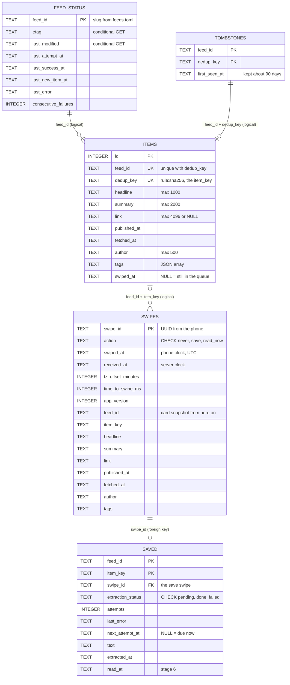
```mermaid
erDiagram
    FEED_STATUS ||--o{ ITEMS : "feed_id (logical)"
    TOMBSTONES ||--o| ITEMS : "feed_id + dedup_key (logical)"
    ITEMS |o--o{ SWIPES : "feed_id + item_key (logical)"
    SWIPES ||--o| SAVED : "swipe_id (foreign key)"

    FEED_STATUS {
        TEXT feed_id PK "slug from feeds.toml"
        TEXT etag "conditional GET"
        TEXT last_modified "conditional GET"
        TEXT last_attempt_at
        TEXT last_success_at
        TEXT last_new_item_at
        TEXT last_error
        INTEGER consecutive_failures
    }
    ITEMS {
        INTEGER id PK
        TEXT feed_id UK "unique with dedup_key"
        TEXT dedup_key UK "rule:sha256, the item_key"
        TEXT headline "max 1000"
        TEXT summary "max 2000"
        TEXT link "max 4096 or NULL"
        TEXT published_at
        TEXT fetched_at
        TEXT author "max 500"
        TEXT tags "JSON array"
        TEXT swiped_at "NULL = still in the queue"
    }
    TOMBSTONES {
        TEXT feed_id PK
        TEXT dedup_key PK
        TEXT first_seen_at "kept about 90 days"
    }
    SWIPES {
        TEXT swipe_id PK "UUID from the phone"
        TEXT action "CHECK never, save, read_now"
        TEXT swiped_at "phone clock, UTC"
        TEXT received_at "server clock"
        INTEGER tz_offset_minutes
        INTEGER time_to_swipe_ms
        INTEGER app_version
        TEXT feed_id "card snapshot from here on"
        TEXT item_key
        TEXT headline
        TEXT summary
        TEXT link
        TEXT published_at
        TEXT fetched_at
        TEXT author
        TEXT tags
    }
    SAVED {
        TEXT feed_id PK
        TEXT item_key PK
        TEXT swipe_id FK "the save swipe"
        TEXT extraction_status "CHECK pending, done, failed"
        INTEGER attempts
        TEXT last_error
        TEXT next_attempt_at "NULL = due now"
        TEXT text
        TEXT extracted_at
        TEXT read_at "stage 6"
    }
```

## 4. Database models (class diagram)

The SQLAlchemy classes in `models.py`. Timestamps use the `UTCDateTime` type: timezone-aware in Python, ISO-8601 UTC text in SQLite.

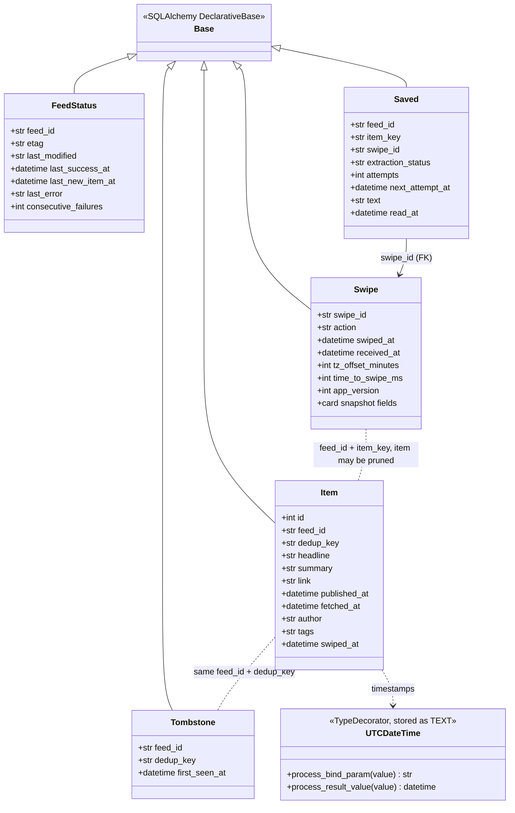
```mermaid
classDiagram
    class Base {
        <<SQLAlchemy DeclarativeBase>>
    }
    class UTCDateTime {
        <<TypeDecorator, stored as TEXT>>
        +process_bind_param(value) str
        +process_result_value(value) datetime
    }
    class FeedStatus {
        +str feed_id
        +str etag
        +str last_modified
        +datetime last_success_at
        +datetime last_new_item_at
        +str last_error
        +int consecutive_failures
    }
    class Item {
        +int id
        +str feed_id
        +str dedup_key
        +str headline
        +str summary
        +str link
        +datetime published_at
        +datetime fetched_at
        +str author
        +str tags
        +datetime swiped_at
    }
    class Tombstone {
        +str feed_id
        +str dedup_key
        +datetime first_seen_at
    }
    class Swipe {
        +str swipe_id
        +str action
        +datetime swiped_at
        +datetime received_at
        +int tz_offset_minutes
        +int time_to_swipe_ms
        +int app_version
        +card snapshot fields
    }
    class Saved {
        +str feed_id
        +str item_key
        +str swipe_id
        +str extraction_status
        +int attempts
        +datetime next_attempt_at
        +str text
        +datetime read_at
    }

    Base <|-- FeedStatus
    Base <|-- Item
    Base <|-- Tombstone
    Base <|-- Swipe
    Base <|-- Saved
    Saved --> Swipe : swipe_id (FK)
    Item .. Tombstone : same feed_id + dedup_key
    Swipe .. Item : feed_id + item_key, item may be pruned
    Item ..> UTCDateTime : timestamps
```

## 5. API models (class diagram)

Generated from `api/openapi.yaml` into `api_models.py`. A swipe *contains* the card exactly as the queue served it.

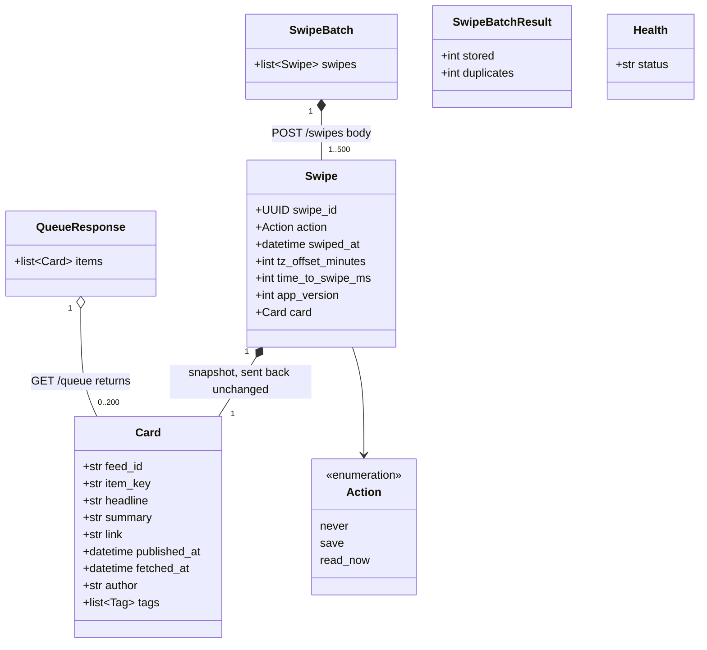
```mermaid
classDiagram
    class Card {
        +str feed_id
        +str item_key
        +str headline
        +str summary
        +str link
        +datetime published_at
        +datetime fetched_at
        +str author
        +list~Tag~ tags
    }
    class Swipe {
        +UUID swipe_id
        +Action action
        +datetime swiped_at
        +int tz_offset_minutes
        +int time_to_swipe_ms
        +int app_version
        +Card card
    }
    class Action {
        <<enumeration>>
        never
        save
        read_now
    }
    class SwipeBatch {
        +list~Swipe~ swipes
    }
    class SwipeBatchResult {
        +int stored
        +int duplicates
    }
    class QueueResponse {
        +list~Card~ items
    }
    class Health {
        +str status
    }

    QueueResponse "1" o-- "0..200" Card : GET /queue returns
    SwipeBatch "1" *-- "1..500" Swipe : POST /swipes body
    Swipe "1" *-- "1" Card : snapshot, sent back unchanged
    Swipe --> Action
```

## 6. Fetch run (sequence)

What happens every 15 minutes. Network I/O never happens inside a database transaction: each feed is fetched and parsed first, then written in one short transaction.

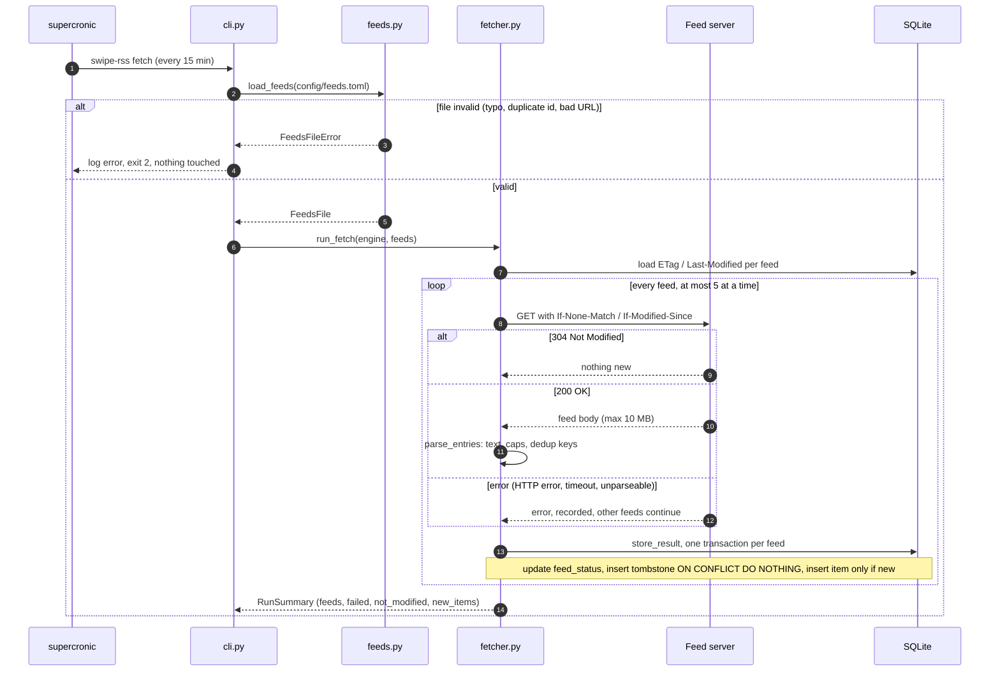
```mermaid
sequenceDiagram
    autonumber
    participant cron as supercronic
    participant cli as cli.py
    participant feeds as feeds.py
    participant fetcher as fetcher.py
    participant web as Feed server
    participant db as SQLite

    cron->>cli: swipe-rss fetch (every 15 min)
    cli->>feeds: load_feeds(config/feeds.toml)
    alt file invalid (typo, duplicate id, bad URL)
        feeds-->>cli: FeedsFileError
        cli-->>cron: log error, exit 2, nothing touched
    else valid
        feeds-->>cli: FeedsFile
        cli->>fetcher: run_fetch(engine, feeds)
        fetcher->>db: load ETag / Last-Modified per feed
        loop every feed, at most 5 at a time
            fetcher->>web: GET with If-None-Match / If-Modified-Since
            alt 304 Not Modified
                web-->>fetcher: nothing new
            else 200 OK
                web-->>fetcher: feed body (max 10 MB)
                fetcher->>fetcher: parse_entries: text, caps, dedup keys
            else error (HTTP error, timeout, unparseable)
                web-->>fetcher: error, recorded, other feeds continue
            end
            fetcher->>db: store_result, one transaction per feed
            Note over fetcher,db: update feed_status, insert tombstone ON CONFLICT DO NOTHING, insert item only if new
        end
        fetcher-->>cli: RunSummary (feeds, failed, not_modified, new_items)
    end
```

## 7. One feed entry through ingest (flowchart)

`parse_entries` (left) turns a raw entry into an item; `store_result` (right) decides whether it is new.

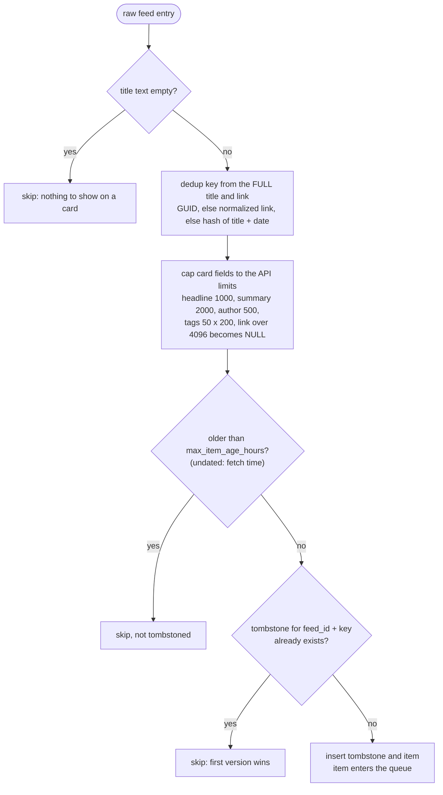
```mermaid
flowchart TD
    entry(["raw feed entry"]) --> title{"title text empty?"}
    title -- yes --> skip1["skip: nothing to show on a card"]
    title -- no --> key["dedup key from the FULL title and link<br/>GUID, else normalized link, else hash of title + date"]
    key --> caps["cap card fields to the API limits<br/>headline 1000, summary 2000, author 500,<br/>tags 50 x 200, link over 4096 becomes NULL"]
    caps --> age{"older than max_item_age_hours?<br/>(undated: fetch time)"}
    age -- yes --> skip2["skip, not tombstoned"]
    age -- no --> tomb{"tombstone for feed_id + key<br/>already exists?"}
    tomb -- yes --> skip3["skip: first version wins"]
    tomb -- no --> insert["insert tombstone and item<br/>item enters the queue"]
```

## 8. Routing and authentication (flowchart)

Secure by default: the token check and the query-parameter check are app-level dependencies, so they run for every route, however the route was registered. Routing happens first: an unknown path or method is answered before any check.

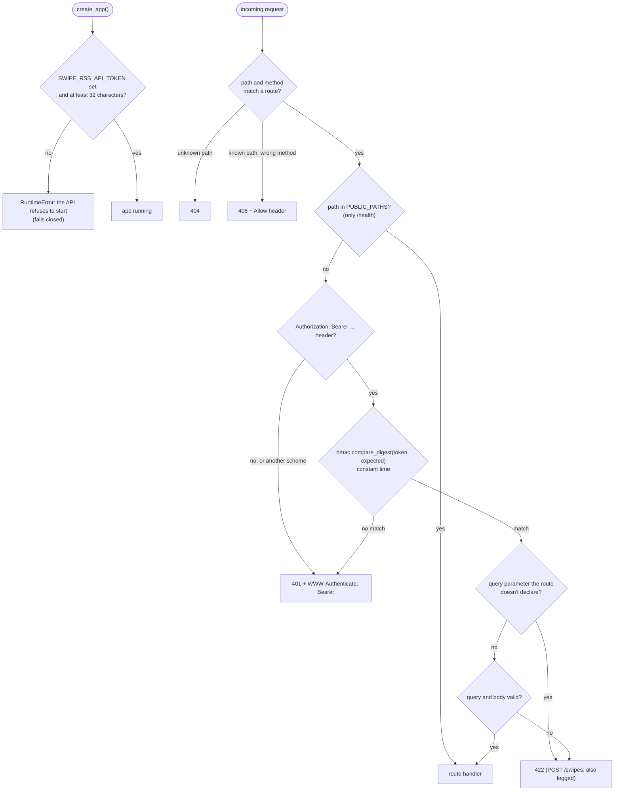
```mermaid
flowchart TD
    start(["create_app()"]) --> strong{"SWIPE_RSS_API_TOKEN set<br/>and at least 32 characters?"}
    strong -- no --> refuse["RuntimeError: the API refuses to start<br/>(fails closed)"]
    strong -- yes --> ready["app running"]

    req(["incoming request"]) --> route{"path and method<br/>match a route?"}
    route -- "unknown path" --> notfound["404"]
    route -- "known path, wrong method" --> notallowed["405 + Allow header"]
    route -- yes --> public{"path in PUBLIC_PATHS?<br/>(only /health)"}
    public -- yes --> handler["route handler"]
    public -- no --> header{"Authorization: Bearer ... header?"}
    header -- "no, or another scheme" --> unauth["401 + WWW-Authenticate: Bearer"]
    header -- yes --> compare{"hmac.compare_digest(token, expected)<br/>constant time"}
    compare -- "no match" --> unauth
    compare -- match --> unknownq{"query parameter the route<br/>doesn't declare?"}
    unknownq -- yes --> invalid["422 (POST /swipes: also logged)"]
    unknownq -- no --> validate{"query and body valid?"}
    validate -- no --> invalid
    validate -- yes --> handler
```

## 9. `GET /queue` (sequence)

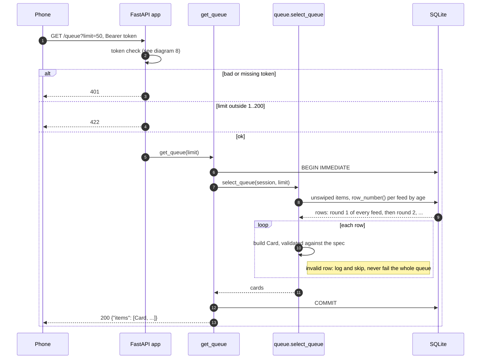
```mermaid
sequenceDiagram
    autonumber
    participant phone as Phone
    participant app as FastAPI app
    participant route as get_queue
    participant queue as queue.select_queue
    participant db as SQLite

    phone->>app: GET /queue?limit=50, Bearer token
    app->>app: token check (see diagram 8)
    alt bad or missing token
        app-->>phone: 401
    else limit outside 1..200
        app-->>phone: 422
    else ok
        app->>route: get_queue(limit)
        route->>db: BEGIN IMMEDIATE
        route->>queue: select_queue(session, limit)
        queue->>db: unswiped items, row_number() per feed by age
        db-->>queue: rows: round 1 of every feed, then round 2, ...
        loop each row
            queue->>queue: build Card, validated against the spec
            Note right of queue: invalid row: log and skip, never fail the whole queue
        end
        queue-->>route: cards
        route->>db: COMMIT
        route-->>phone: 200 {"items": [Card, ...]}
    end
```

## 10. `POST /swipes` (sequence)

One transaction per batch. A resent batch is harmless: already stored swipes are counted as duplicates.

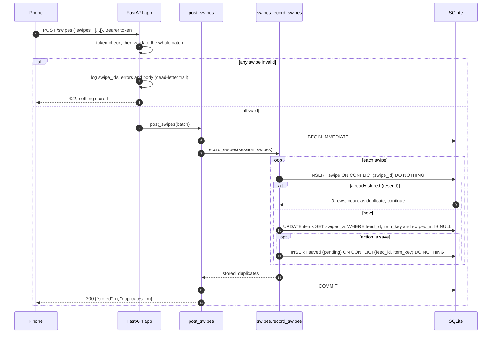
```mermaid
sequenceDiagram
    autonumber
    participant phone as Phone
    participant app as FastAPI app
    participant route as post_swipes
    participant rec as swipes.record_swipes
    participant db as SQLite

    phone->>app: POST /swipes {"swipes": [...]}, Bearer token
    app->>app: token check, then validate the whole batch
    alt any swipe invalid
        app->>app: log swipe_ids, errors and body (dead-letter trail)
        app-->>phone: 422, nothing stored
    else all valid
        app->>route: post_swipes(batch)
        route->>db: BEGIN IMMEDIATE
        route->>rec: record_swipes(session, swipes)
        loop each swipe
            rec->>db: INSERT swipe ON CONFLICT(swipe_id) DO NOTHING
            alt already stored (resend)
                db-->>rec: 0 rows, count as duplicate, continue
            else new
                rec->>db: UPDATE items SET swiped_at WHERE feed_id, item_key and swiped_at IS NULL
                opt action is save
                    rec->>db: INSERT saved (pending) ON CONFLICT(feed_id, item_key) DO NOTHING
                end
            end
        end
        rec-->>route: stored, duplicates
        route->>db: COMMIT
        route-->>phone: 200 {"stored": n, "duplicates": m}
    end
```

## 11. `GET /feeds`, `GET /saved` and saved content (sequence)

Read-only endpoints. `/feeds` re-reads `feeds.toml` on every request, like the fetcher; saved entries take their display fields from the save swipe, so they survive item pruning.

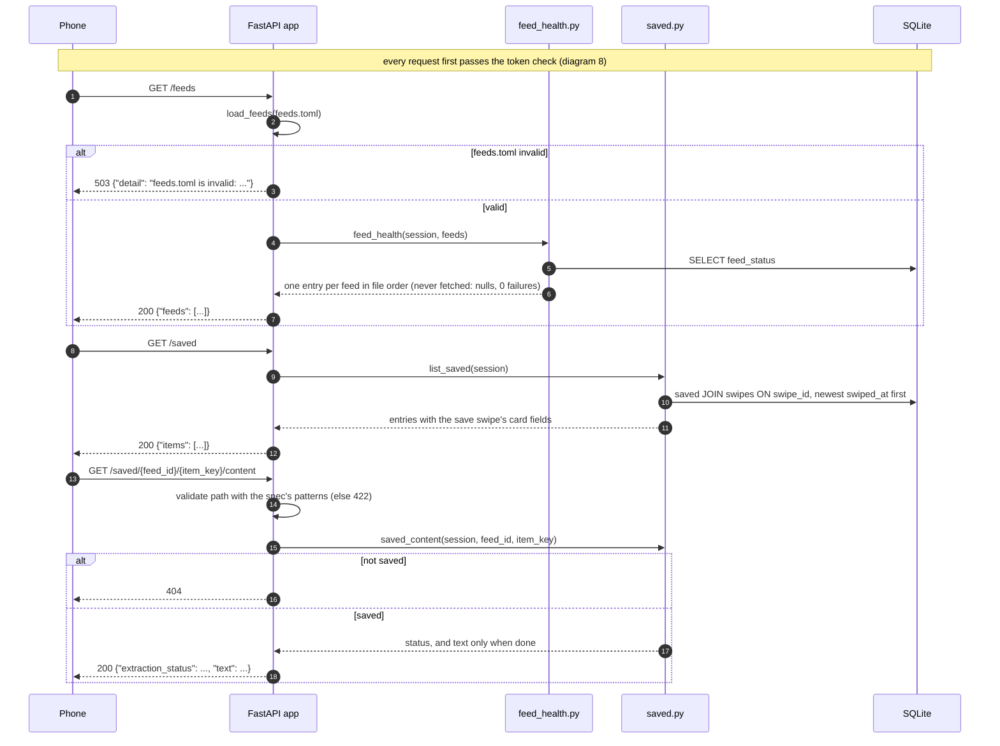
```mermaid
sequenceDiagram
    autonumber
    participant phone as Phone
    participant app as FastAPI app
    participant health as feed_health.py
    participant saved as saved.py
    participant db as SQLite

    Note over phone,db: every request first passes the token check (diagram 8)

    phone->>app: GET /feeds
    app->>app: load_feeds(feeds.toml)
    alt feeds.toml invalid
        app-->>phone: 503 {"detail": "feeds.toml is invalid: ..."}
    else valid
        app->>health: feed_health(session, feeds)
        health->>db: SELECT feed_status
        health-->>app: one entry per feed in file order (never fetched: nulls, 0 failures)
        app-->>phone: 200 {"feeds": [...]}
    end

    phone->>app: GET /saved
    app->>saved: list_saved(session)
    saved->>db: saved JOIN swipes ON swipe_id, newest swiped_at first
    saved-->>app: entries with the save swipe's card fields
    app-->>phone: 200 {"items": [...]}

    phone->>app: GET /saved/{feed_id}/{item_key}/content
    app->>app: validate path with the spec's patterns (else 422)
    app->>saved: saved_content(session, feed_id, item_key)
    alt not saved
        app-->>phone: 404
    else saved
        saved-->>app: status, and text only when done
        app-->>phone: 200 {"extraction_status": ..., "text": ...}
    end
```

## 12. Extraction job (sequence)

`swipe-rss extract`, every minute. The `saved` table is the job queue; network I/O never happens inside a transaction.

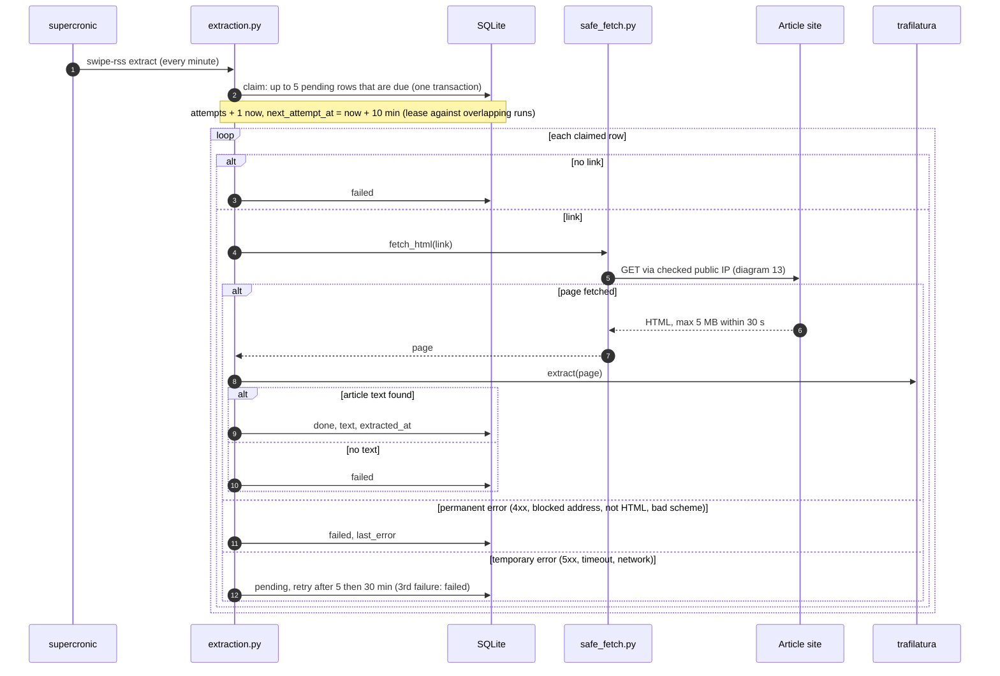
```mermaid
sequenceDiagram
    autonumber
    participant cron as supercronic
    participant job as extraction.py
    participant db as SQLite
    participant guard as safe_fetch.py
    participant web as Article site
    participant traf as trafilatura

    cron->>job: swipe-rss extract (every minute)
    job->>db: claim: up to 5 pending rows that are due (one transaction)
    Note over job,db: attempts + 1 now, next_attempt_at = now + 10 min (lease against overlapping runs)
    loop each claimed row
        alt no link
            job->>db: failed
        else link
            job->>guard: fetch_html(link)
            guard->>web: GET via checked public IP (diagram 13)
            alt page fetched
                web-->>guard: HTML, max 5 MB within 30 s
                guard-->>job: page
                job->>traf: extract(page)
                alt article text found
                    job->>db: done, text, extracted_at
                else no text
                    job->>db: failed
                end
            else permanent error (4xx, blocked address, not HTML, bad scheme)
                job->>db: failed, last_error
            else temporary error (5xx, timeout, network)
                job->>db: pending, retry after 5 then 30 min (3rd failure: failed)
            end
        end
    end
```

## 13. SSRF guard: connect-time check (flowchart)

Runs for the first URL and again for every redirect hop, inside the connection itself.

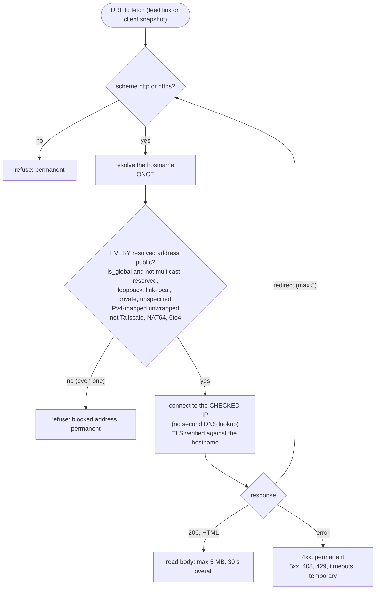
```mermaid
flowchart TD
    url(["URL to fetch (feed link or client snapshot)"]) --> scheme{"scheme http or https?"}
    scheme -- no --> refuse1["refuse: permanent"]
    scheme -- yes --> resolve["resolve the hostname ONCE"]
    resolve --> every{"EVERY resolved address public?<br/>is_global and not multicast, reserved,<br/>loopback, link-local, private, unspecified;<br/>IPv4-mapped unwrapped;<br/>not Tailscale, NAT64, 6to4"}
    every -- "no (even one)" --> refuse2["refuse: blocked address, permanent"]
    every -- yes --> connect["connect to the CHECKED IP<br/>(no second DNS lookup)<br/>TLS verified against the hostname"]
    connect --> response{"response"}
    response -- "redirect (max 5)" --> scheme
    response -- "200, HTML" --> read["read body: max 5 MB, 30 s overall"]
    response -- "error" --> classify["4xx: permanent<br/>5xx, 408, 429, timeouts: temporary"]
```

## 14. Item lifecycle (state diagram)

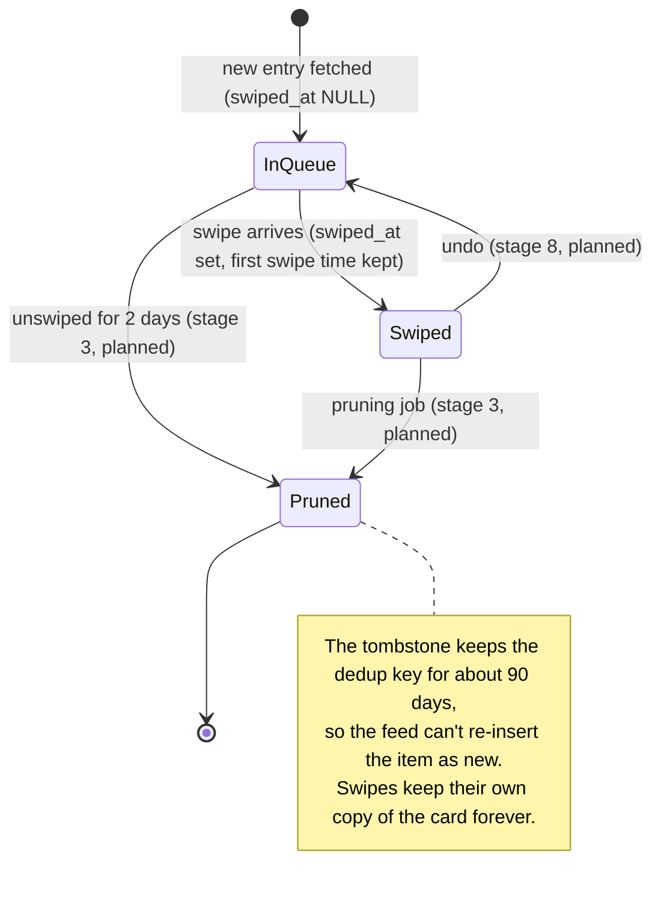
```mermaid
stateDiagram-v2
    [*] --> InQueue: new entry fetched (swiped_at NULL)
    InQueue --> Swiped: swipe arrives (swiped_at set, first swipe time kept)
    Swiped --> InQueue: undo (stage 8, planned)
    InQueue --> Pruned: unswiped for 2 days (stage 3, planned)
    Swiped --> Pruned: pruning job (stage 3, planned)
    Pruned --> [*]
    note right of Pruned
        The tombstone keeps the dedup key for about 90 days,
        so the feed can't re-insert the item as new.
        Swipes keep their own copy of the card forever.
    end note
```

## 15. Saved entry extraction (state diagram)

The extraction job (diagram 12) moves entries between these states.

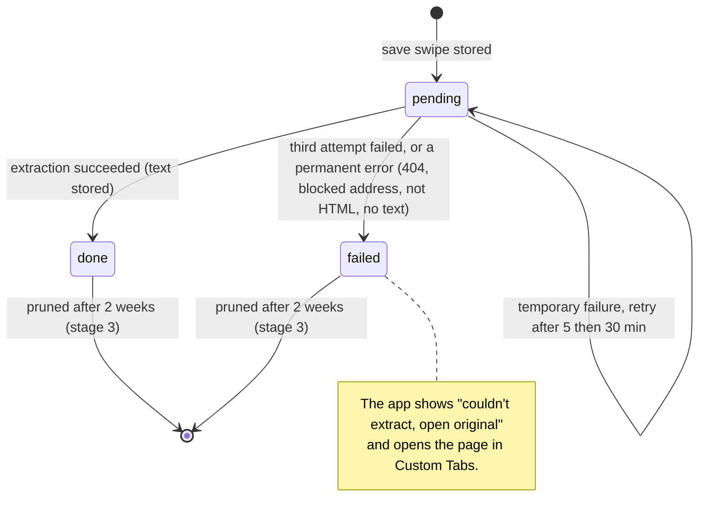
```mermaid
stateDiagram-v2
    [*] --> pending: save swipe stored
    pending --> done: extraction succeeded (text stored)
    pending --> pending: temporary failure, retry after 5 then 30 min
    pending --> failed: third attempt failed, or a permanent error (404, blocked address, not HTML, no text)
    done --> [*]: pruned after 2 weeks (stage 3)
    failed --> [*]: pruned after 2 weeks (stage 3)
    note right of failed
        The app shows "couldn't extract, open original"
        and opens the page in Custom Tabs.
    end note
```

## 16. Phone swipe sync (sequence, planned)

How the Android app (stage 5) is designed to use `POST /swipes`, including the dead-letter fallback.

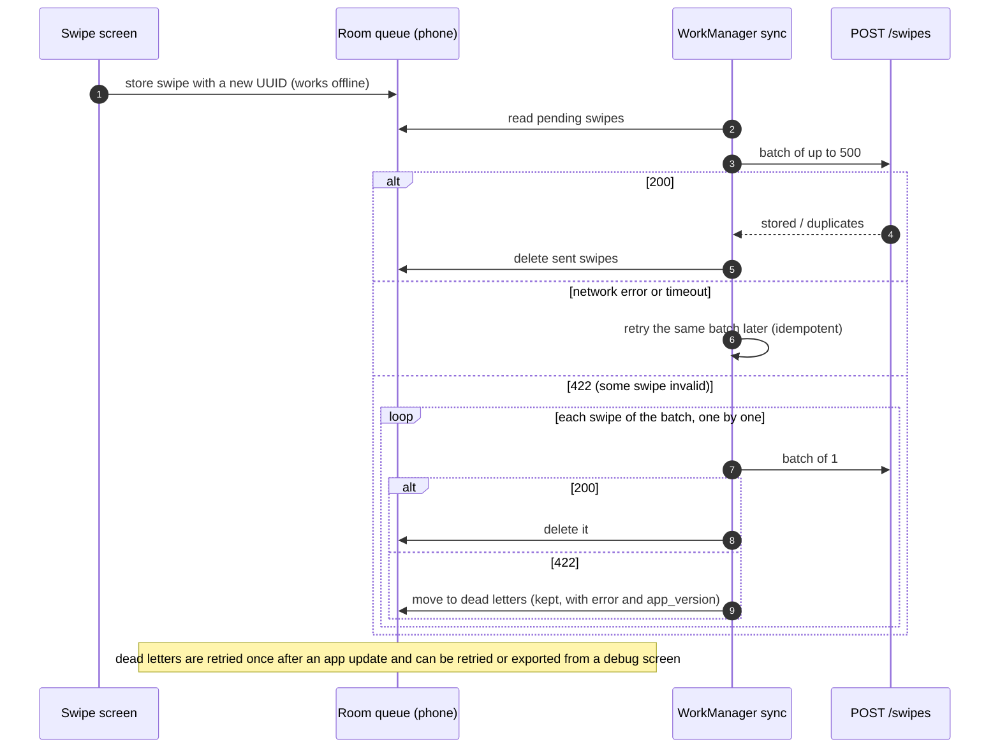
```mermaid
sequenceDiagram
    autonumber
    participant ui as Swipe screen
    participant room as Room queue (phone)
    participant work as WorkManager sync
    participant api as POST /swipes

    ui->>room: store swipe with a new UUID (works offline)
    work->>room: read pending swipes
    work->>api: batch of up to 500
    alt 200
        api-->>work: stored / duplicates
        work->>room: delete sent swipes
    else network error or timeout
        work->>work: retry the same batch later (idempotent)
    else 422 (some swipe invalid)
        loop each swipe of the batch, one by one
            work->>api: batch of 1
            alt 200
                work->>room: delete it
            else 422
                work->>room: move to dead letters (kept, with error and app_version)
            end
        end
    end
    Note over room: dead letters are retried once after an app update and can be retried or exported from a debug screen
```

## 17. Mutation checks: `scripts/mutants.py` (flowchart)

How the curated mutation checks decide each verdict. Details are in the script's docstring and in [`backend/tests/README.md`](../backend/tests/README.md).

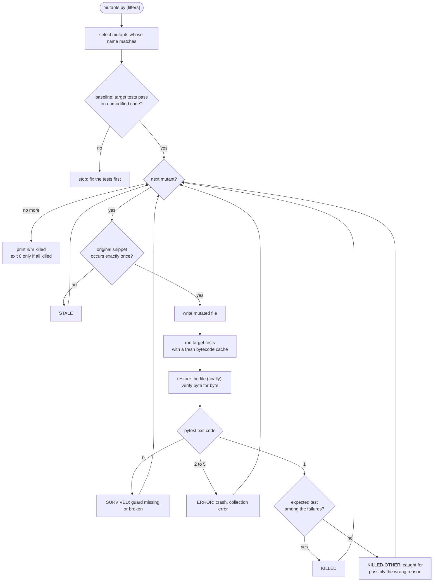
```mermaid
flowchart TD
    start(["mutants.py [filters]"]) --> select["select mutants whose name matches"]
    select --> baseline{"baseline: target tests pass<br/>on unmodified code?"}
    baseline -- no --> stop["stop: fix the tests first"]
    baseline -- yes --> next{"next mutant?"}
    next -- "no more" --> summary["print n/m killed<br/>exit 0 only if all killed"]
    next -- yes --> once{"original snippet<br/>occurs exactly once?"}
    once -- no --> stale["STALE"]
    once -- yes --> write["write mutated file"]
    write --> run["run target tests<br/>with a fresh bytecode cache"]
    run --> restore["restore the file (finally),<br/>verify byte for byte"]
    restore --> code{"pytest exit code"}
    code -- 0 --> survived["SURVIVED: guard missing or broken"]
    code -- "2 to 5" --> error["ERROR: crash, collection error"]
    code -- 1 --> which{"expected test<br/>among the failures?"}
    which -- yes --> killed["KILLED"]
    which -- no --> other["KILLED-OTHER: caught for<br/>possibly the wrong reason"]
    stale & survived & error & killed & other --> next
```

## 18. Development loop (flowchart)

All development happens on the desktop; the server only pulls committed code.

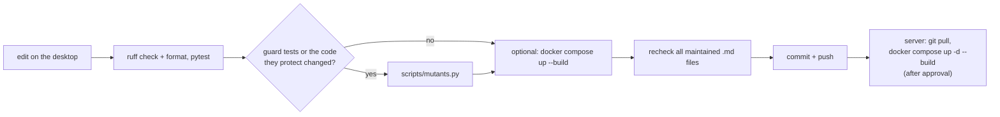
```mermaid
flowchart LR
    edit["edit on the desktop"] --> check["ruff check + format, pytest"]
    check --> mut{"guard tests or the code<br/>they protect changed?"}
    mut -- yes --> mutants["scripts/mutants.py"]
    mut -- no --> docker
    mutants --> docker["optional: docker compose up --build"]
    docker --> recheck["recheck all maintained .md files"]
    recheck --> commit["commit + push"]
    commit --> deploy["server: git pull,<br/>docker compose up -d --build<br/>(after approval)"]
```
